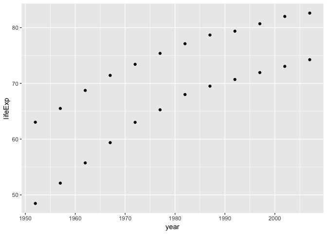
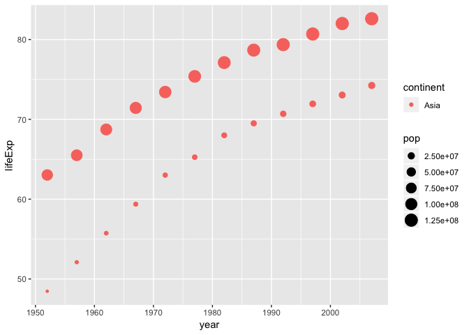
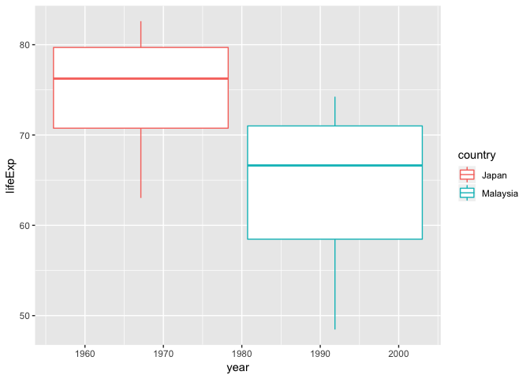
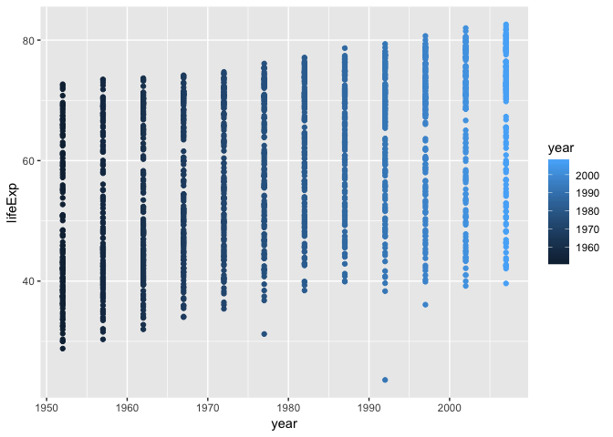

hw01\_gapminder
================
Seevasant Indran
18 September, 2018

Lets explore the gapminder dataset.

Getting Started with Gapminder
------------------------------

``` r
#Load the gapminder dataset and the tidyverse library.
library(gapminder)
library(tidyverse)
```

Lets have a look at the Gapminder dataset
-----------------------------------------

``` r
# Lets see what is the gapminder data is all about in a separate window
View(gapminder) 
```

``` r
#lets assign the gapminder dataset to the variable hw01gapminder, number of onservation (rows = 1704) and variables (column = 6), look on the global environment.

hw01gapminder <- gapminder

# check if the assigned data is true in the original dataset using the ncol() and nrow() function.

ncol(gapminder) == ncol(hw01gapminder)
```

    ## [1] TRUE

``` r
ncol(gapminder) == ncol(hw01gapminder)
```

    ## [1] TRUE

``` r
#View the top and the botttom 6 of the gapminder dataset
  
head(hw01gapminder)
```

    ## # A tibble: 6 x 6
    ##   country     continent  year lifeExp      pop gdpPercap
    ##   <fct>       <fct>     <int>   <dbl>    <int>     <dbl>
    ## 1 Afghanistan Asia       1952    28.8  8425333      779.
    ## 2 Afghanistan Asia       1957    30.3  9240934      821.
    ## 3 Afghanistan Asia       1962    32.0 10267083      853.
    ## 4 Afghanistan Asia       1967    34.0 11537966      836.
    ## 5 Afghanistan Asia       1972    36.1 13079460      740.
    ## 6 Afghanistan Asia       1977    38.4 14880372      786.

``` r
tail(hw01gapminder)
```

    ## # A tibble: 6 x 6
    ##   country  continent  year lifeExp      pop gdpPercap
    ##   <fct>    <fct>     <int>   <dbl>    <int>     <dbl>
    ## 1 Zimbabwe Africa     1982    60.4  7636524      789.
    ## 2 Zimbabwe Africa     1987    62.4  9216418      706.
    ## 3 Zimbabwe Africa     1992    60.4 10704340      693.
    ## 4 Zimbabwe Africa     1997    46.8 11404948      792.
    ## 5 Zimbabwe Africa     2002    40.0 11926563      672.
    ## 6 Zimbabwe Africa     2007    43.5 12311143      470.

Lets plot the data
------------------

``` r
#Using ggplot to plot life expectancy vs year
ggplot(data = hw01gapminder) + 
  geom_point(mapping = aes(x = year, y = lifeExp))
```



It seems that the life epectancy has increased over the last 50 years.

``` r
#Using ggplot to plot life expectancy vs year using colour to separate by continents
ggplot(data = hw01gapminder) + 
  geom_point(mapping = aes(x = year, y = lifeExp, color = continent))
```



The African continent has the lowest life expectancy and Europe has the highest life expentancy.

``` r
ggplot(data = hw01gapminder) + 
  geom_point(mapping = aes(x = year, y = lifeExp, color = continent, size = pop))
```



Asia has the highest population although it can be seen the population in Asia has gotten smaller in recent years.

``` r
ggplot(data = hw01gapminder) + 
  geom_point(mapping = aes(x = year, y = lifeExp, color = year))
```


