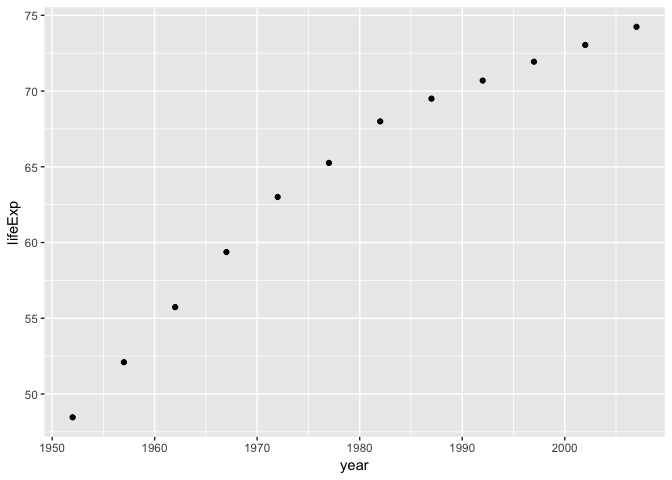
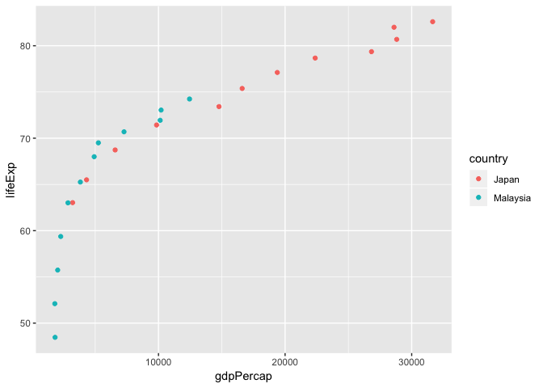
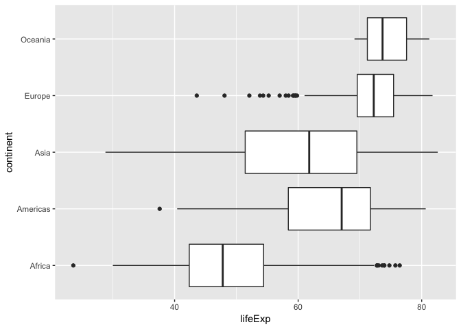

hw01\_gapminder
================
Seevasant Indran
06 October, 2018

Lets explore the gapminder dataset of hw01 part 2

Getting Started with Gapminder
------------------------------

``` r
#Load the gapminder dataset and the tidyverse library.

library(gapminder)
library(tidyverse)
```

Lets explore the Gapminder dataset structure
--------------------------------------------

``` r
# First lets see what is the gapminder data is all about in a separate window

View(gapminder) 
```

``` r
# lets assign the gapminder dataset to the variable hw01gapminder.

hw01gapminder <- gapminder # Number of observation (rows = 1704) and variables (column = 6), look on the global environment

# Checking class type
class (hw01gapminder) 
```

    ## [1] "tbl_df"     "tbl"        "data.frame"

``` r
# Help about getting it to show more rows, looks like it the default displays 6 rows
?head() 

# lets set n = 10, so it will display 10 rows from the top
head(hw01gapminder, n = 10) 
```

    ## # A tibble: 10 x 6
    ##    country     continent  year lifeExp      pop gdpPercap
    ##    <fct>       <fct>     <int>   <dbl>    <int>     <dbl>
    ##  1 Afghanistan Asia       1952    28.8  8425333      779.
    ##  2 Afghanistan Asia       1957    30.3  9240934      821.
    ##  3 Afghanistan Asia       1962    32.0 10267083      853.
    ##  4 Afghanistan Asia       1967    34.0 11537966      836.
    ##  5 Afghanistan Asia       1972    36.1 13079460      740.
    ##  6 Afghanistan Asia       1977    38.4 14880372      786.
    ##  7 Afghanistan Asia       1982    39.9 12881816      978.
    ##  8 Afghanistan Asia       1987    40.8 13867957      852.
    ##  9 Afghanistan Asia       1992    41.7 16317921      649.
    ## 10 Afghanistan Asia       1997    41.8 22227415      635.

``` r
# Show 6 rows from the bottom
tail(hw01gapminder)
```

    ## # A tibble: 6 x 6
    ##   country  continent  year lifeExp      pop gdpPercap
    ##   <fct>    <fct>     <int>   <dbl>    <int>     <dbl>
    ## 1 Zimbabwe Africa     1982    60.4  7636524      789.
    ## 2 Zimbabwe Africa     1987    62.4  9216418      706.
    ## 3 Zimbabwe Africa     1992    60.4 10704340      693.
    ## 4 Zimbabwe Africa     1997    46.8 11404948      792.
    ## 5 Zimbabwe Africa     2002    40.0 11926563      672.
    ## 6 Zimbabwe Africa     2007    43.5 12311143      470.

``` r
# Is "country" a character ?
is.character(hw01gapminder$country)
```

    ## [1] FALSE

``` r
# Is "country"" a factor ? 
is.factor(hw01gapminder$country) 
```

    ## [1] TRUE

``` r
# Structure of the gapminder data
str(hw01gapminder)
```

    ## Classes 'tbl_df', 'tbl' and 'data.frame':    1704 obs. of  6 variables:
    ##  $ country  : Factor w/ 142 levels "Afghanistan",..: 1 1 1 1 1 1 1 1 1 1 ...
    ##  $ continent: Factor w/ 5 levels "Africa","Americas",..: 3 3 3 3 3 3 3 3 3 3 ...
    ##  $ year     : int  1952 1957 1962 1967 1972 1977 1982 1987 1992 1997 ...
    ##  $ lifeExp  : num  28.8 30.3 32 34 36.1 ...
    ##  $ pop      : int  8425333 9240934 10267083 11537966 13079460 14880372 12881816 13867957 16317921 22227415 ...
    ##  $ gdpPercap: num  779 821 853 836 740 ...

``` r
# Dimensions of the dataframe (nrows x ncols)
dim(hw01gapminder) 
```

    ## [1] 1704    6

``` r
# Let see if the dim() output matches the ncol() and nrow() function.

nrow(hw01gapminder)
```

    ## [1] 1704

``` r
ncol(hw01gapminder)
```

    ## [1] 6

``` r
# Getting "fancy" with checking if dimensions match row/column number.

(dim(hw01gapminder)[1]) == nrow(hw01gapminder)
```

    ## [1] TRUE

``` r
(dim(hw01gapminder)[2]) == ncol(hw01gapminder)
```

    ## [1] TRUE

``` r
# What variables are measured ?
colnames(hw01gapminder)
```

    ## [1] "country"   "continent" "year"      "lifeExp"   "pop"       "gdpPercap"

``` r
# What are the observations (countries) ?
levels(hw01gapminder$country)
```

    ##   [1] "Afghanistan"              "Albania"                 
    ##   [3] "Algeria"                  "Angola"                  
    ##   [5] "Argentina"                "Australia"               
    ##   [7] "Austria"                  "Bahrain"                 
    ##   [9] "Bangladesh"               "Belgium"                 
    ##  [11] "Benin"                    "Bolivia"                 
    ##  [13] "Bosnia and Herzegovina"   "Botswana"                
    ##  [15] "Brazil"                   "Bulgaria"                
    ##  [17] "Burkina Faso"             "Burundi"                 
    ##  [19] "Cambodia"                 "Cameroon"                
    ##  [21] "Canada"                   "Central African Republic"
    ##  [23] "Chad"                     "Chile"                   
    ##  [25] "China"                    "Colombia"                
    ##  [27] "Comoros"                  "Congo, Dem. Rep."        
    ##  [29] "Congo, Rep."              "Costa Rica"              
    ##  [31] "Cote d'Ivoire"            "Croatia"                 
    ##  [33] "Cuba"                     "Czech Republic"          
    ##  [35] "Denmark"                  "Djibouti"                
    ##  [37] "Dominican Republic"       "Ecuador"                 
    ##  [39] "Egypt"                    "El Salvador"             
    ##  [41] "Equatorial Guinea"        "Eritrea"                 
    ##  [43] "Ethiopia"                 "Finland"                 
    ##  [45] "France"                   "Gabon"                   
    ##  [47] "Gambia"                   "Germany"                 
    ##  [49] "Ghana"                    "Greece"                  
    ##  [51] "Guatemala"                "Guinea"                  
    ##  [53] "Guinea-Bissau"            "Haiti"                   
    ##  [55] "Honduras"                 "Hong Kong, China"        
    ##  [57] "Hungary"                  "Iceland"                 
    ##  [59] "India"                    "Indonesia"               
    ##  [61] "Iran"                     "Iraq"                    
    ##  [63] "Ireland"                  "Israel"                  
    ##  [65] "Italy"                    "Jamaica"                 
    ##  [67] "Japan"                    "Jordan"                  
    ##  [69] "Kenya"                    "Korea, Dem. Rep."        
    ##  [71] "Korea, Rep."              "Kuwait"                  
    ##  [73] "Lebanon"                  "Lesotho"                 
    ##  [75] "Liberia"                  "Libya"                   
    ##  [77] "Madagascar"               "Malawi"                  
    ##  [79] "Malaysia"                 "Mali"                    
    ##  [81] "Mauritania"               "Mauritius"               
    ##  [83] "Mexico"                   "Mongolia"                
    ##  [85] "Montenegro"               "Morocco"                 
    ##  [87] "Mozambique"               "Myanmar"                 
    ##  [89] "Namibia"                  "Nepal"                   
    ##  [91] "Netherlands"              "New Zealand"             
    ##  [93] "Nicaragua"                "Niger"                   
    ##  [95] "Nigeria"                  "Norway"                  
    ##  [97] "Oman"                     "Pakistan"                
    ##  [99] "Panama"                   "Paraguay"                
    ## [101] "Peru"                     "Philippines"             
    ## [103] "Poland"                   "Portugal"                
    ## [105] "Puerto Rico"              "Reunion"                 
    ## [107] "Romania"                  "Rwanda"                  
    ## [109] "Sao Tome and Principe"    "Saudi Arabia"            
    ## [111] "Senegal"                  "Serbia"                  
    ## [113] "Sierra Leone"             "Singapore"               
    ## [115] "Slovak Republic"          "Slovenia"                
    ## [117] "Somalia"                  "South Africa"            
    ## [119] "Spain"                    "Sri Lanka"               
    ## [121] "Sudan"                    "Swaziland"               
    ## [123] "Sweden"                   "Switzerland"             
    ## [125] "Syria"                    "Taiwan"                  
    ## [127] "Tanzania"                 "Thailand"                
    ## [129] "Togo"                     "Trinidad and Tobago"     
    ## [131] "Tunisia"                  "Turkey"                  
    ## [133] "Uganda"                   "United Kingdom"          
    ## [135] "United States"            "Uruguay"                 
    ## [137] "Venezuela"                "Vietnam"                 
    ## [139] "West Bank and Gaza"       "Yemen, Rep."             
    ## [141] "Zambia"                   "Zimbabwe"

``` r
# Limit for summary is 100 factors lets change it the number of factors. Each country has data for 12 years
summary(hw01gapminder$country, maxsum = 142)
```

    ##              Afghanistan                  Albania                  Algeria 
    ##                       12                       12                       12 
    ##                   Angola                Argentina                Australia 
    ##                       12                       12                       12 
    ##                  Austria                  Bahrain               Bangladesh 
    ##                       12                       12                       12 
    ##                  Belgium                    Benin                  Bolivia 
    ##                       12                       12                       12 
    ##   Bosnia and Herzegovina                 Botswana                   Brazil 
    ##                       12                       12                       12 
    ##                 Bulgaria             Burkina Faso                  Burundi 
    ##                       12                       12                       12 
    ##                 Cambodia                 Cameroon                   Canada 
    ##                       12                       12                       12 
    ## Central African Republic                     Chad                    Chile 
    ##                       12                       12                       12 
    ##                    China                 Colombia                  Comoros 
    ##                       12                       12                       12 
    ##         Congo, Dem. Rep.              Congo, Rep.               Costa Rica 
    ##                       12                       12                       12 
    ##            Cote d'Ivoire                  Croatia                     Cuba 
    ##                       12                       12                       12 
    ##           Czech Republic                  Denmark                 Djibouti 
    ##                       12                       12                       12 
    ##       Dominican Republic                  Ecuador                    Egypt 
    ##                       12                       12                       12 
    ##              El Salvador        Equatorial Guinea                  Eritrea 
    ##                       12                       12                       12 
    ##                 Ethiopia                  Finland                   France 
    ##                       12                       12                       12 
    ##                    Gabon                   Gambia                  Germany 
    ##                       12                       12                       12 
    ##                    Ghana                   Greece                Guatemala 
    ##                       12                       12                       12 
    ##                   Guinea            Guinea-Bissau                    Haiti 
    ##                       12                       12                       12 
    ##                 Honduras         Hong Kong, China                  Hungary 
    ##                       12                       12                       12 
    ##                  Iceland                    India                Indonesia 
    ##                       12                       12                       12 
    ##                     Iran                     Iraq                  Ireland 
    ##                       12                       12                       12 
    ##                   Israel                    Italy                  Jamaica 
    ##                       12                       12                       12 
    ##                    Japan                   Jordan                    Kenya 
    ##                       12                       12                       12 
    ##         Korea, Dem. Rep.              Korea, Rep.                   Kuwait 
    ##                       12                       12                       12 
    ##                  Lebanon                  Lesotho                  Liberia 
    ##                       12                       12                       12 
    ##                    Libya               Madagascar                   Malawi 
    ##                       12                       12                       12 
    ##                 Malaysia                     Mali               Mauritania 
    ##                       12                       12                       12 
    ##                Mauritius                   Mexico                 Mongolia 
    ##                       12                       12                       12 
    ##               Montenegro                  Morocco               Mozambique 
    ##                       12                       12                       12 
    ##                  Myanmar                  Namibia                    Nepal 
    ##                       12                       12                       12 
    ##              Netherlands              New Zealand                Nicaragua 
    ##                       12                       12                       12 
    ##                    Niger                  Nigeria                   Norway 
    ##                       12                       12                       12 
    ##                     Oman                 Pakistan                   Panama 
    ##                       12                       12                       12 
    ##                 Paraguay                     Peru              Philippines 
    ##                       12                       12                       12 
    ##                   Poland                 Portugal              Puerto Rico 
    ##                       12                       12                       12 
    ##                  Reunion                  Romania                   Rwanda 
    ##                       12                       12                       12 
    ##    Sao Tome and Principe             Saudi Arabia                  Senegal 
    ##                       12                       12                       12 
    ##                   Serbia             Sierra Leone                Singapore 
    ##                       12                       12                       12 
    ##          Slovak Republic                 Slovenia                  Somalia 
    ##                       12                       12                       12 
    ##             South Africa                    Spain                Sri Lanka 
    ##                       12                       12                       12 
    ##                    Sudan                Swaziland                   Sweden 
    ##                       12                       12                       12 
    ##              Switzerland                    Syria                   Taiwan 
    ##                       12                       12                       12 
    ##                 Tanzania                 Thailand                     Togo 
    ##                       12                       12                       12 
    ##      Trinidad and Tobago                  Tunisia                   Turkey 
    ##                       12                       12                       12 
    ##                   Uganda           United Kingdom            United States 
    ##                       12                       12                       12 
    ##                  Uruguay                Venezuela                  Vietnam 
    ##                       12                       12                       12 
    ##       West Bank and Gaza              Yemen, Rep.                   Zambia 
    ##                       12                       12                       12 
    ##                 Zimbabwe 
    ##                       12

``` r
# Is Malaysia in the list ? 
"Malaysia" %in% hw01gapminder$country
```

    ## [1] TRUE

More data exploration
---------------------

``` r
# Highest value for year
max(hw01gapminder$year) 
```

    ## [1] 2007

``` r
# Minimum value for year
min(hw01gapminder$year) 
```

    ## [1] 1952

``` r
# Maximum value of age
max(hw01gapminder$lifeExp) 
```

    ## [1] 82.603

``` r
# Minimum value of age
min(hw01gapminder$lifeExp) 
```

    ## [1] 23.599

``` r
# Maximum value of GDP per capita
max(hw01gapminder$gdpPercap) 
```

    ## [1] 113523.1

``` r
# Minimum value of GDP per capita
min(hw01gapminder$gdpPercap) 
```

    ## [1] 241.1659

``` r
# An overview of the statistics
summary(hw01gapminder)
```

    ##         country        continent        year         lifeExp     
    ##  Afghanistan:  12   Africa  :624   Min.   :1952   Min.   :23.60  
    ##  Albania    :  12   Americas:300   1st Qu.:1966   1st Qu.:48.20  
    ##  Algeria    :  12   Asia    :396   Median :1980   Median :60.71  
    ##  Angola     :  12   Europe  :360   Mean   :1980   Mean   :59.47  
    ##  Argentina  :  12   Oceania : 24   3rd Qu.:1993   3rd Qu.:70.85  
    ##  Australia  :  12                  Max.   :2007   Max.   :82.60  
    ##  (Other)    :1632                                                
    ##       pop              gdpPercap       
    ##  Min.   :6.001e+04   Min.   :   241.2  
    ##  1st Qu.:2.794e+06   1st Qu.:  1202.1  
    ##  Median :7.024e+06   Median :  3531.8  
    ##  Mean   :2.960e+07   Mean   :  7215.3  
    ##  3rd Qu.:1.959e+07   3rd Qu.:  9325.5  
    ##  Max.   :1.319e+09   Max.   :113523.1  
    ## 

Malaysia gapminder data
-----------------------

``` r
# I am from Malaysia, lets see how is Malaysia doing
GapminderMalaysia <- hw01gapminder %>% filter(country == "Malaysia")
head(GapminderMalaysia, n= 12)
```

    ## # A tibble: 12 x 6
    ##    country  continent  year lifeExp      pop gdpPercap
    ##    <fct>    <fct>     <int>   <dbl>    <int>     <dbl>
    ##  1 Malaysia Asia       1952    48.5  6748378     1831.
    ##  2 Malaysia Asia       1957    52.1  7739235     1810.
    ##  3 Malaysia Asia       1962    55.7  8906385     2037.
    ##  4 Malaysia Asia       1967    59.4 10154878     2278.
    ##  5 Malaysia Asia       1972    63.0 11441462     2849.
    ##  6 Malaysia Asia       1977    65.3 12845381     3828.
    ##  7 Malaysia Asia       1982    68   14441916     4920.
    ##  8 Malaysia Asia       1987    69.5 16331785     5250.
    ##  9 Malaysia Asia       1992    70.7 18319502     7278.
    ## 10 Malaysia Asia       1997    71.9 20476091    10133.
    ## 11 Malaysia Asia       2002    73.0 22662365    10207.
    ## 12 Malaysia Asia       2007    74.2 24821286    12452.

``` r
# Lets figure out which country has the highest life expectancy 
arrange(gapminder, desc(lifeExp))
```

    ## # A tibble: 1,704 x 6
    ##    country          continent  year lifeExp       pop gdpPercap
    ##    <fct>            <fct>     <int>   <dbl>     <int>     <dbl>
    ##  1 Japan            Asia       2007    82.6 127467972    31656.
    ##  2 Hong Kong, China Asia       2007    82.2   6980412    39725.
    ##  3 Japan            Asia       2002    82   127065841    28605.
    ##  4 Iceland          Europe     2007    81.8    301931    36181.
    ##  5 Switzerland      Europe     2007    81.7   7554661    37506.
    ##  6 Hong Kong, China Asia       2002    81.5   6762476    30209.
    ##  7 Australia        Oceania    2007    81.2  20434176    34435.
    ##  8 Spain            Europe     2007    80.9  40448191    28821.
    ##  9 Sweden           Europe     2007    80.9   9031088    33860.
    ## 10 Israel           Asia       2007    80.7   6426679    25523.
    ## # ... with 1,694 more rows

``` r
# Lets pull out Malaysia and Japan to compare them
GapminderJapMas <- hw01gapminder %>% filter(country == "Malaysia" | country == "Japan")

# Lets look at the statistics
summary(GapminderJapMas)
```

    ##         country      continent       year         lifeExp     
    ##  Japan      :12   Africa  : 0   Min.   :1952   Min.   :48.46  
    ##  Malaysia   :12   Americas: 0   1st Qu.:1966   1st Qu.:64.70  
    ##  Afghanistan: 0   Asia    :24   Median :1980   Median :71.06  
    ##  Albania    : 0   Europe  : 0   Mean   :1980   Mean   :69.55  
    ##  Algeria    : 0   Oceania : 0   3rd Qu.:1993   3rd Qu.:75.81  
    ##  Angola     : 0                 Max.   :2007   Max.   :82.60  
    ##  (Other)    : 0                                               
    ##       pop              gdpPercap    
    ##  Min.   :  6748378   Min.   : 1810  
    ##  1st Qu.: 14042782   1st Qu.: 3675  
    ##  Median : 55640156   Median : 8563  
    ##  Mean   : 63166432   Mean   :11578  
    ##  3rd Qu.:115018098   3rd Qu.:17304  
    ##  Max.   :127467972   Max.   :31656  
    ## 

``` r
# The levels from the old dataframe are still retained, lets drop them out and try summary() again
GapminderJapMas<-droplevels(GapminderJapMas)
summary(GapminderJapMas)
```

    ##      country   continent      year         lifeExp     
    ##  Japan   :12   Asia:24   Min.   :1952   Min.   :48.46  
    ##  Malaysia:12             1st Qu.:1966   1st Qu.:64.70  
    ##                          Median :1980   Median :71.06  
    ##                          Mean   :1980   Mean   :69.55  
    ##                          3rd Qu.:1993   3rd Qu.:75.81  
    ##                          Max.   :2007   Max.   :82.60  
    ##       pop              gdpPercap    
    ##  Min.   :  6748378   Min.   : 1810  
    ##  1st Qu.: 14042782   1st Qu.: 3675  
    ##  Median : 55640156   Median : 8563  
    ##  Mean   : 63166432   Mean   :11578  
    ##  3rd Qu.:115018098   3rd Qu.:17304  
    ##  Max.   :127467972   Max.   :31656

It is not very clear from these, let's visualize these data in the next section.

Plotting the data for visualization
-----------------------------------

``` r
#Using ggplot to plot life expectancy vs year for Malaysians
ggplot(data = GapminderMalaysia) + 
  geom_point(mapping = aes(x = year, y = lifeExp))
```



I guess I will live another day to do more stats 540.

### Malaysia vs Japan life expectancy

``` r
# Box plot displays the data above better
ggplot(data = GapminderJapMas) + 
  geom_boxplot(mapping = aes(x = pop, y = lifeExp, color = country)) + coord_flip()
```


The median for Japanese is ~76 years old and the median for Malaysians is ~66 years old. 10 years !!, those sushi's must have something in them. Next, lets explore in terms of GDP and life expectancy throughout the years.

``` r
ggplot(data = GapminderJapMas) + 
  geom_point(mapping = aes(x = gdpPercap, y = lifeExp, color = country))
```



Japan has a very linear GDP growth. There seems to be some form of correlation between GDP per capita and life expectancy, lets try to see if this holds across all the continent.

``` r
ggplot(data = hw01gapminder) + 
  geom_point(mapping = aes(x = gdpPercap, y = lifeExp, color = continent))
```


``` r
# Finding the asian outliers on the plot
arrange(hw01gapminder, desc(gdpPercap, lifeExp))
```

    ## # A tibble: 1,704 x 6
    ##    country   continent  year lifeExp     pop gdpPercap
    ##    <fct>     <fct>     <int>   <dbl>   <int>     <dbl>
    ##  1 Kuwait    Asia       1957    58.0  212846   113523.
    ##  2 Kuwait    Asia       1972    67.7  841934   109348.
    ##  3 Kuwait    Asia       1952    55.6  160000   108382.
    ##  4 Kuwait    Asia       1962    60.5  358266    95458.
    ##  5 Kuwait    Asia       1967    64.6  575003    80895.
    ##  6 Kuwait    Asia       1977    69.3 1140357    59265.
    ##  7 Norway    Europe     2007    80.2 4627926    49357.
    ##  8 Kuwait    Asia       2007    77.6 2505559    47307.
    ##  9 Singapore Asia       2007    80.0 4553009    47143.
    ## 10 Norway    Europe     2002    79.0 4535591    44684.
    ## # ... with 1,694 more rows

Looks like GDP per capita has an effect on health except in Kuwait, but it is hard to say with the data squeezed onto the left side of the plot. [Kuwait life expectancy article](https://www.ndtv.com/world-news/average-life-expectancy-of-indians-in-kuwait-way-below-national-figures-684817)

### World GDP per capita vs Life Expectancy

``` r
# The outliers (Kuwait) is making it hard to viusalize the data, lets try dropping it of out the dataframe to see if it imporves the plot visualization using the (!= not "Kuwait" operator)

GapminderNoKuwait <- hw01gapminder %>% filter(!country=="Kuwait")
droplevels(GapminderNoKuwait)
```

    ## # A tibble: 1,692 x 6
    ##    country     continent  year lifeExp      pop gdpPercap
    ##    <fct>       <fct>     <int>   <dbl>    <int>     <dbl>
    ##  1 Afghanistan Asia       1952    28.8  8425333      779.
    ##  2 Afghanistan Asia       1957    30.3  9240934      821.
    ##  3 Afghanistan Asia       1962    32.0 10267083      853.
    ##  4 Afghanistan Asia       1967    34.0 11537966      836.
    ##  5 Afghanistan Asia       1972    36.1 13079460      740.
    ##  6 Afghanistan Asia       1977    38.4 14880372      786.
    ##  7 Afghanistan Asia       1982    39.9 12881816      978.
    ##  8 Afghanistan Asia       1987    40.8 13867957      852.
    ##  9 Afghanistan Asia       1992    41.7 16317921      649.
    ## 10 Afghanistan Asia       1997    41.8 22227415      635.
    ## # ... with 1,682 more rows

``` r
"Kuwait" %in% GapminderNoKuwait$country
```

    ## [1] FALSE

### World GDP per capita vs Life Expectancy (without Kuwait)

``` r
ggplot(data = GapminderNoKuwait) + 
  geom_point(mapping = aes(x = gdpPercap, y = lifeExp, color = continent))
```


There seem to be some correlation in GDP per capita vs Life Expectancy and it is clearer now that the plot is more spread out.

### Life expectancy (all continents)

``` r
# Boxplot life expectancy in different continents
ggplot(data = hw01gapminder) + 
  geom_boxplot(mapping = aes(x = continent, y = lifeExp)) + coord_flip()
```



The African continent has the lowest median life expectancy and Australia and Europe has the highest life expentancy.

``` r
# Boxplot life expectancy vs population in different continents

ggplot(data = hw01gapminder) + 
  geom_boxplot(mapping = aes(x = pop, y = lifeExp, color = continent))  + coord_flip()
```


Australia has the smallest range of life expectancy from 1952 - 2007 and the smallest continent population, Asia has the largest range of life Expectancy. It seems the population size does corelate with life expectancies, except in Africa. One possible reason could be due to lower GDP per Capita, therefore has a poorer nationwide health infrastucture.
