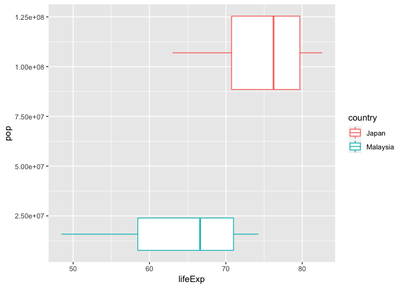

hw01\_gapminder
================
Seevasant Indran
18 September, 2018

Lets explore the gapminder dataset.

Getting Started with Gapminder
------------------------------

``` r
#Load the gapminder dataset and the tidyverse library.

library(gapminder)
library(tidyverse)
```

Lets explore the Gapminder dataset structure
--------------------------------------------

``` r
# First lets see what is the gapminder data is all about in a separate window

View(gapminder) 
```

``` r
# lets assign the gapminder dataset to the variable hw01gapminder.

hw01gapminder <- gapminder # Number of observation (rows = 1704) and variables (column = 6), look on the global environment

# Checking class type
class (hw01gapminder) 
```

    ## [1] "tbl_df"     "tbl"        "data.frame"

``` r
# Help about getting it to show more rows, "head(x, n = 6L, ...) ## S3 method for class 'data.frame", looks like it the default shows 6 rows head() or tail()
?head() 

# lets set n = 10, so it will display 10 rows from the top
head(hw01gapminder, n = 10) 
```

    ## # A tibble: 10 x 6
    ##    country     continent  year lifeExp      pop gdpPercap
    ##    <fct>       <fct>     <int>   <dbl>    <int>     <dbl>
    ##  1 Afghanistan Asia       1952    28.8  8425333      779.
    ##  2 Afghanistan Asia       1957    30.3  9240934      821.
    ##  3 Afghanistan Asia       1962    32.0 10267083      853.
    ##  4 Afghanistan Asia       1967    34.0 11537966      836.
    ##  5 Afghanistan Asia       1972    36.1 13079460      740.
    ##  6 Afghanistan Asia       1977    38.4 14880372      786.
    ##  7 Afghanistan Asia       1982    39.9 12881816      978.
    ##  8 Afghanistan Asia       1987    40.8 13867957      852.
    ##  9 Afghanistan Asia       1992    41.7 16317921      649.
    ## 10 Afghanistan Asia       1997    41.8 22227415      635.

``` r
# Show 6 rows from the bottom
tail(hw01gapminder)
```

    ## # A tibble: 6 x 6
    ##   country  continent  year lifeExp      pop gdpPercap
    ##   <fct>    <fct>     <int>   <dbl>    <int>     <dbl>
    ## 1 Zimbabwe Africa     1982    60.4  7636524      789.
    ## 2 Zimbabwe Africa     1987    62.4  9216418      706.
    ## 3 Zimbabwe Africa     1992    60.4 10704340      693.
    ## 4 Zimbabwe Africa     1997    46.8 11404948      792.
    ## 5 Zimbabwe Africa     2002    40.0 11926563      672.
    ## 6 Zimbabwe Africa     2007    43.5 12311143      470.

``` r
# structure of the data set using the "str" function
str(hw01gapminder)
```

    ## Classes 'tbl_df', 'tbl' and 'data.frame':    1704 obs. of  6 variables:
    ##  $ country  : Factor w/ 142 levels "Afghanistan",..: 1 1 1 1 1 1 1 1 1 1 ...
    ##  $ continent: Factor w/ 5 levels "Africa","Americas",..: 3 3 3 3 3 3 3 3 3 3 ...
    ##  $ year     : int  1952 1957 1962 1967 1972 1977 1982 1987 1992 1997 ...
    ##  $ lifeExp  : num  28.8 30.3 32 34 36.1 ...
    ##  $ pop      : int  8425333 9240934 10267083 11537966 13079460 14880372 12881816 13867957 16317921 22227415 ...
    ##  $ gdpPercap: num  779 821 853 836 740 ...

``` r
# dimensions of the dataframe (nrows x ncols)
dim(hw01gapminder) 
```

    ## [1] 1704    6

``` r
# let see if the dim() output matches the ncol() and nrow() function.

nrow(hw01gapminder)
```

    ## [1] 1704

``` r
ncol(hw01gapminder)
```

    ## [1] 6

``` r
# What variables are measure
colnames(hw01gapminder)
```

    ## [1] "country"   "continent" "year"      "lifeExp"   "pop"       "gdpPercap"

``` r
# What are the observation (countries) 
levels(hw01gapminder$country)
```

    ##   [1] "Afghanistan"              "Albania"                 
    ##   [3] "Algeria"                  "Angola"                  
    ##   [5] "Argentina"                "Australia"               
    ##   [7] "Austria"                  "Bahrain"                 
    ##   [9] "Bangladesh"               "Belgium"                 
    ##  [11] "Benin"                    "Bolivia"                 
    ##  [13] "Bosnia and Herzegovina"   "Botswana"                
    ##  [15] "Brazil"                   "Bulgaria"                
    ##  [17] "Burkina Faso"             "Burundi"                 
    ##  [19] "Cambodia"                 "Cameroon"                
    ##  [21] "Canada"                   "Central African Republic"
    ##  [23] "Chad"                     "Chile"                   
    ##  [25] "China"                    "Colombia"                
    ##  [27] "Comoros"                  "Congo, Dem. Rep."        
    ##  [29] "Congo, Rep."              "Costa Rica"              
    ##  [31] "Cote d'Ivoire"            "Croatia"                 
    ##  [33] "Cuba"                     "Czech Republic"          
    ##  [35] "Denmark"                  "Djibouti"                
    ##  [37] "Dominican Republic"       "Ecuador"                 
    ##  [39] "Egypt"                    "El Salvador"             
    ##  [41] "Equatorial Guinea"        "Eritrea"                 
    ##  [43] "Ethiopia"                 "Finland"                 
    ##  [45] "France"                   "Gabon"                   
    ##  [47] "Gambia"                   "Germany"                 
    ##  [49] "Ghana"                    "Greece"                  
    ##  [51] "Guatemala"                "Guinea"                  
    ##  [53] "Guinea-Bissau"            "Haiti"                   
    ##  [55] "Honduras"                 "Hong Kong, China"        
    ##  [57] "Hungary"                  "Iceland"                 
    ##  [59] "India"                    "Indonesia"               
    ##  [61] "Iran"                     "Iraq"                    
    ##  [63] "Ireland"                  "Israel"                  
    ##  [65] "Italy"                    "Jamaica"                 
    ##  [67] "Japan"                    "Jordan"                  
    ##  [69] "Kenya"                    "Korea, Dem. Rep."        
    ##  [71] "Korea, Rep."              "Kuwait"                  
    ##  [73] "Lebanon"                  "Lesotho"                 
    ##  [75] "Liberia"                  "Libya"                   
    ##  [77] "Madagascar"               "Malawi"                  
    ##  [79] "Malaysia"                 "Mali"                    
    ##  [81] "Mauritania"               "Mauritius"               
    ##  [83] "Mexico"                   "Mongolia"                
    ##  [85] "Montenegro"               "Morocco"                 
    ##  [87] "Mozambique"               "Myanmar"                 
    ##  [89] "Namibia"                  "Nepal"                   
    ##  [91] "Netherlands"              "New Zealand"             
    ##  [93] "Nicaragua"                "Niger"                   
    ##  [95] "Nigeria"                  "Norway"                  
    ##  [97] "Oman"                     "Pakistan"                
    ##  [99] "Panama"                   "Paraguay"                
    ## [101] "Peru"                     "Philippines"             
    ## [103] "Poland"                   "Portugal"                
    ## [105] "Puerto Rico"              "Reunion"                 
    ## [107] "Romania"                  "Rwanda"                  
    ## [109] "Sao Tome and Principe"    "Saudi Arabia"            
    ## [111] "Senegal"                  "Serbia"                  
    ## [113] "Sierra Leone"             "Singapore"               
    ## [115] "Slovak Republic"          "Slovenia"                
    ## [117] "Somalia"                  "South Africa"            
    ## [119] "Spain"                    "Sri Lanka"               
    ## [121] "Sudan"                    "Swaziland"               
    ## [123] "Sweden"                   "Switzerland"             
    ## [125] "Syria"                    "Taiwan"                  
    ## [127] "Tanzania"                 "Thailand"                
    ## [129] "Togo"                     "Trinidad and Tobago"     
    ## [131] "Tunisia"                  "Turkey"                  
    ## [133] "Uganda"                   "United Kingdom"          
    ## [135] "United States"            "Uruguay"                 
    ## [137] "Venezuela"                "Vietnam"                 
    ## [139] "West Bank and Gaza"       "Yemen, Rep."             
    ## [141] "Zambia"                   "Zimbabwe"

``` r
summary(hw01gapminder$country, maxsum = 142)# the limit for summary is 100 factors lets change it the number of factors. Each country is represented 12 times
```

    ##              Afghanistan                  Albania                  Algeria 
    ##                       12                       12                       12 
    ##                   Angola                Argentina                Australia 
    ##                       12                       12                       12 
    ##                  Austria                  Bahrain               Bangladesh 
    ##                       12                       12                       12 
    ##                  Belgium                    Benin                  Bolivia 
    ##                       12                       12                       12 
    ##   Bosnia and Herzegovina                 Botswana                   Brazil 
    ##                       12                       12                       12 
    ##                 Bulgaria             Burkina Faso                  Burundi 
    ##                       12                       12                       12 
    ##                 Cambodia                 Cameroon                   Canada 
    ##                       12                       12                       12 
    ## Central African Republic                     Chad                    Chile 
    ##                       12                       12                       12 
    ##                    China                 Colombia                  Comoros 
    ##                       12                       12                       12 
    ##         Congo, Dem. Rep.              Congo, Rep.               Costa Rica 
    ##                       12                       12                       12 
    ##            Cote d'Ivoire                  Croatia                     Cuba 
    ##                       12                       12                       12 
    ##           Czech Republic                  Denmark                 Djibouti 
    ##                       12                       12                       12 
    ##       Dominican Republic                  Ecuador                    Egypt 
    ##                       12                       12                       12 
    ##              El Salvador        Equatorial Guinea                  Eritrea 
    ##                       12                       12                       12 
    ##                 Ethiopia                  Finland                   France 
    ##                       12                       12                       12 
    ##                    Gabon                   Gambia                  Germany 
    ##                       12                       12                       12 
    ##                    Ghana                   Greece                Guatemala 
    ##                       12                       12                       12 
    ##                   Guinea            Guinea-Bissau                    Haiti 
    ##                       12                       12                       12 
    ##                 Honduras         Hong Kong, China                  Hungary 
    ##                       12                       12                       12 
    ##                  Iceland                    India                Indonesia 
    ##                       12                       12                       12 
    ##                     Iran                     Iraq                  Ireland 
    ##                       12                       12                       12 
    ##                   Israel                    Italy                  Jamaica 
    ##                       12                       12                       12 
    ##                    Japan                   Jordan                    Kenya 
    ##                       12                       12                       12 
    ##         Korea, Dem. Rep.              Korea, Rep.                   Kuwait 
    ##                       12                       12                       12 
    ##                  Lebanon                  Lesotho                  Liberia 
    ##                       12                       12                       12 
    ##                    Libya               Madagascar                   Malawi 
    ##                       12                       12                       12 
    ##                 Malaysia                     Mali               Mauritania 
    ##                       12                       12                       12 
    ##                Mauritius                   Mexico                 Mongolia 
    ##                       12                       12                       12 
    ##               Montenegro                  Morocco               Mozambique 
    ##                       12                       12                       12 
    ##                  Myanmar                  Namibia                    Nepal 
    ##                       12                       12                       12 
    ##              Netherlands              New Zealand                Nicaragua 
    ##                       12                       12                       12 
    ##                    Niger                  Nigeria                   Norway 
    ##                       12                       12                       12 
    ##                     Oman                 Pakistan                   Panama 
    ##                       12                       12                       12 
    ##                 Paraguay                     Peru              Philippines 
    ##                       12                       12                       12 
    ##                   Poland                 Portugal              Puerto Rico 
    ##                       12                       12                       12 
    ##                  Reunion                  Romania                   Rwanda 
    ##                       12                       12                       12 
    ##    Sao Tome and Principe             Saudi Arabia                  Senegal 
    ##                       12                       12                       12 
    ##                   Serbia             Sierra Leone                Singapore 
    ##                       12                       12                       12 
    ##          Slovak Republic                 Slovenia                  Somalia 
    ##                       12                       12                       12 
    ##             South Africa                    Spain                Sri Lanka 
    ##                       12                       12                       12 
    ##                    Sudan                Swaziland                   Sweden 
    ##                       12                       12                       12 
    ##              Switzerland                    Syria                   Taiwan 
    ##                       12                       12                       12 
    ##                 Tanzania                 Thailand                     Togo 
    ##                       12                       12                       12 
    ##      Trinidad and Tobago                  Tunisia                   Turkey 
    ##                       12                       12                       12 
    ##                   Uganda           United Kingdom            United States 
    ##                       12                       12                       12 
    ##                  Uruguay                Venezuela                  Vietnam 
    ##                       12                       12                       12 
    ##       West Bank and Gaza              Yemen, Rep.                   Zambia 
    ##                       12                       12                       12 
    ##                 Zimbabwe 
    ##                       12

``` r
# Perhaps the unique function is more suited towards 
unique(hw01gapminder$country)
```

    ##   [1] Afghanistan              Albania                 
    ##   [3] Algeria                  Angola                  
    ##   [5] Argentina                Australia               
    ##   [7] Austria                  Bahrain                 
    ##   [9] Bangladesh               Belgium                 
    ##  [11] Benin                    Bolivia                 
    ##  [13] Bosnia and Herzegovina   Botswana                
    ##  [15] Brazil                   Bulgaria                
    ##  [17] Burkina Faso             Burundi                 
    ##  [19] Cambodia                 Cameroon                
    ##  [21] Canada                   Central African Republic
    ##  [23] Chad                     Chile                   
    ##  [25] China                    Colombia                
    ##  [27] Comoros                  Congo, Dem. Rep.        
    ##  [29] Congo, Rep.              Costa Rica              
    ##  [31] Cote d'Ivoire            Croatia                 
    ##  [33] Cuba                     Czech Republic          
    ##  [35] Denmark                  Djibouti                
    ##  [37] Dominican Republic       Ecuador                 
    ##  [39] Egypt                    El Salvador             
    ##  [41] Equatorial Guinea        Eritrea                 
    ##  [43] Ethiopia                 Finland                 
    ##  [45] France                   Gabon                   
    ##  [47] Gambia                   Germany                 
    ##  [49] Ghana                    Greece                  
    ##  [51] Guatemala                Guinea                  
    ##  [53] Guinea-Bissau            Haiti                   
    ##  [55] Honduras                 Hong Kong, China        
    ##  [57] Hungary                  Iceland                 
    ##  [59] India                    Indonesia               
    ##  [61] Iran                     Iraq                    
    ##  [63] Ireland                  Israel                  
    ##  [65] Italy                    Jamaica                 
    ##  [67] Japan                    Jordan                  
    ##  [69] Kenya                    Korea, Dem. Rep.        
    ##  [71] Korea, Rep.              Kuwait                  
    ##  [73] Lebanon                  Lesotho                 
    ##  [75] Liberia                  Libya                   
    ##  [77] Madagascar               Malawi                  
    ##  [79] Malaysia                 Mali                    
    ##  [81] Mauritania               Mauritius               
    ##  [83] Mexico                   Mongolia                
    ##  [85] Montenegro               Morocco                 
    ##  [87] Mozambique               Myanmar                 
    ##  [89] Namibia                  Nepal                   
    ##  [91] Netherlands              New Zealand             
    ##  [93] Nicaragua                Niger                   
    ##  [95] Nigeria                  Norway                  
    ##  [97] Oman                     Pakistan                
    ##  [99] Panama                   Paraguay                
    ## [101] Peru                     Philippines             
    ## [103] Poland                   Portugal                
    ## [105] Puerto Rico              Reunion                 
    ## [107] Romania                  Rwanda                  
    ## [109] Sao Tome and Principe    Saudi Arabia            
    ## [111] Senegal                  Serbia                  
    ## [113] Sierra Leone             Singapore               
    ## [115] Slovak Republic          Slovenia                
    ## [117] Somalia                  South Africa            
    ## [119] Spain                    Sri Lanka               
    ## [121] Sudan                    Swaziland               
    ## [123] Sweden                   Switzerland             
    ## [125] Syria                    Taiwan                  
    ## [127] Tanzania                 Thailand                
    ## [129] Togo                     Trinidad and Tobago     
    ## [131] Tunisia                  Turkey                  
    ## [133] Uganda                   United Kingdom          
    ## [135] United States            Uruguay                 
    ## [137] Venezuela                Vietnam                 
    ## [139] West Bank and Gaza       Yemen, Rep.             
    ## [141] Zambia                   Zimbabwe                
    ## 142 Levels: Afghanistan Albania Algeria Angola Argentina ... Zimbabwe

----------------------------------------------------------------------------------------
----------------------------------------------------------------------------------------

More data exploration
=====================

----------------------------------------------------------------------------------------
----------------------------------------------------------------------------------------

``` r
# An overview of the statistics
summary(hw01gapminder)
```

    ##         country        continent        year         lifeExp     
    ##  Afghanistan:  12   Africa  :624   Min.   :1952   Min.   :23.60  
    ##  Albania    :  12   Americas:300   1st Qu.:1966   1st Qu.:48.20  
    ##  Algeria    :  12   Asia    :396   Median :1980   Median :60.71  
    ##  Angola     :  12   Europe  :360   Mean   :1980   Mean   :59.47  
    ##  Argentina  :  12   Oceania : 24   3rd Qu.:1993   3rd Qu.:70.85  
    ##  Australia  :  12                  Max.   :2007   Max.   :82.60  
    ##  (Other)    :1632                                                
    ##       pop              gdpPercap       
    ##  Min.   :6.001e+04   Min.   :   241.2  
    ##  1st Qu.:2.794e+06   1st Qu.:  1202.1  
    ##  Median :7.024e+06   Median :  3531.8  
    ##  Mean   :2.960e+07   Mean   :  7215.3  
    ##  3rd Qu.:1.959e+07   3rd Qu.:  9325.5  
    ##  Max.   :1.319e+09   Max.   :113523.1  
    ## 

``` r
# 8. Highest value for variable/ column year
max(hw01gapminder$year) 
```

    ## [1] 2007

``` r
# 9. Minimum value in the column, year
min(hw01gapminder$year) 
```

    ## [1] 1952

``` r
# I am from Malaysia, lets see how is my country doing
GapminderMalaysia <- hw01gapminder %>% filter(country == "Malaysia")

summary(GapminderMalaysia)
```

    ##         country      continent       year         lifeExp     
    ##  Malaysia   :12   Africa  : 0   Min.   :1952   Min.   :48.46  
    ##  Afghanistan: 0   Americas: 0   1st Qu.:1966   1st Qu.:58.46  
    ##  Albania    : 0   Asia    :12   Median :1980   Median :66.63  
    ##  Algeria    : 0   Europe  : 0   Mean   :1980   Mean   :64.28  
    ##  Angola     : 0   Oceania : 0   3rd Qu.:1993   3rd Qu.:71.00  
    ##  Argentina  : 0                 Max.   :2007   Max.   :74.24  
    ##  (Other)    : 0                                               
    ##       pop             gdpPercap    
    ##  Min.   : 6748378   Min.   : 1810  
    ##  1st Qu.: 9842755   1st Qu.: 2218  
    ##  Median :13643648   Median : 4374  
    ##  Mean   :14574055   Mean   : 5406  
    ##  3rd Qu.:18858649   3rd Qu.: 7992  
    ##  Max.   :24821286   Max.   :12452  
    ## 

``` r
# Lets see which country has the highest life expectancy

arrange(gapminder, desc(lifeExp))
```

    ## # A tibble: 1,704 x 6
    ##    country          continent  year lifeExp       pop gdpPercap
    ##    <fct>            <fct>     <int>   <dbl>     <int>     <dbl>
    ##  1 Japan            Asia       2007    82.6 127467972    31656.
    ##  2 Hong Kong, China Asia       2007    82.2   6980412    39725.
    ##  3 Japan            Asia       2002    82   127065841    28605.
    ##  4 Iceland          Europe     2007    81.8    301931    36181.
    ##  5 Switzerland      Europe     2007    81.7   7554661    37506.
    ##  6 Hong Kong, China Asia       2002    81.5   6762476    30209.
    ##  7 Australia        Oceania    2007    81.2  20434176    34435.
    ##  8 Spain            Europe     2007    80.9  40448191    28821.
    ##  9 Sweden           Europe     2007    80.9   9031088    33860.
    ## 10 Israel           Asia       2007    80.7   6426679    25523.
    ## # ... with 1,694 more rows

``` r
# Lets compare Malaysia and Japan

GapminderJapMas <- hw01gapminder %>% filter(country == "Malaysia" | country == "Japan")
```

Its a bit too hard to look at the table lets visualize it in the next section

Lets plot the data
------------------

``` r
#Using ggplot to plot life expectancy vs year
ggplot(data = GapminderJapMas) + 
  geom_point(mapping = aes(x = year, y = lifeExp))
```


``` r
ggplot(data = GapminderJapMas) + 
  geom_point(mapping = aes(x = year, y = lifeExp, color = continent, size = pop))
```


``` r
# Box plot displays the data above better
ggplot(data = GapminderJapMas) + 
  geom_boxplot(mapping = aes(x = year, y = lifeExp, color = country))
```


``` r
#Using ggplot to plot life expectancy vs year using colour to separate by continents
ggplot(data = hw01gapminder) + 
  geom_point(mapping = aes(x = year, y = lifeExp, color = continent, size = pop))
```


``` r
# Box plot displays the data above better
ggplot(data = hw01gapminder) + 
  geom_boxplot(mapping = aes(x = year, y = lifeExp, color = continent))
```


The African continent has the lowest life expectancy and Europe has the highest life expentancy.

Asia has the highest population although it can be seen the population in Asia has gotten smaller in recent years.

``` r
ggplot(data = hw01gapminder) + 
  geom_point(mapping = aes(x = year, y = lifeExp, color = year))
```


